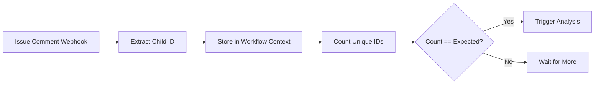
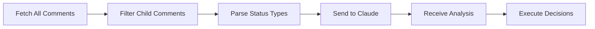
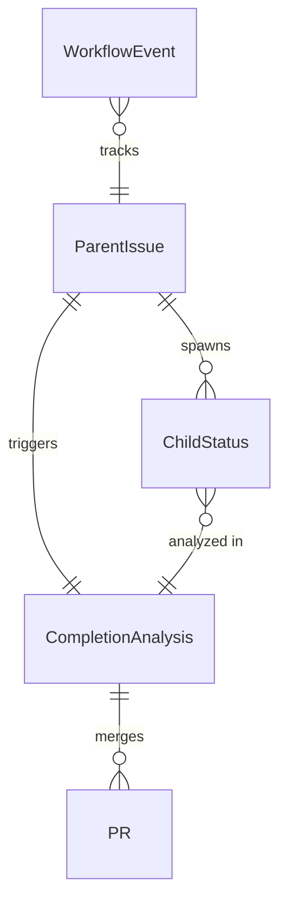

# Data Model: Child Agent Completion Tracking System

## Overview
Data structures and state transitions for the completion detection system. All data is ephemeral and derived from GitHub's API - no persistent storage.

## Core Entities

### 1. ParentIssue
Represents the GitHub issue that spawned child agents.

**Fields**:
- `issue_number`: Integer - GitHub issue number
- `issue_body`: String - Full issue body text
- `expected_child_count`: Integer - Extracted from issue body
- `created_at`: Timestamp - Issue creation time
- `author`: String - User who triggered the parent agent

**Validation Rules**:
- `issue_number` > 0
- `expected_child_count` >= 0 and <= 5 (max parallel children)

**State Transitions**:
```
CREATED → CHILDREN_SPAWNED → AWAITING_COMPLETIONS → ANALYZING → COMPLETE
```

### 2. ChildStatus
Represents a child agent's reported completion status.

**Fields**:
- `child_id`: String - Unique identifier (e.g., "C1", "C2")
- `comment_id`: Integer - GitHub comment ID
- `comment_body`: String - Full comment text
- `status_type`: Enum - SUCCESS | FAILURE | PARTIAL | AMBIGUOUS
- `pr_number`: Optional[Integer] - Associated PR if successful
- `failure_reason`: Optional[String] - Extracted failure description
- `timestamp`: Timestamp - When status was reported

**Validation Rules**:
- `comment_body` must contain "🤖 Child"
- `child_id` must match pattern `C\d+`
- If `status_type` == SUCCESS, `pr_number` should be present
- If `status_type` == FAILURE, `failure_reason` should be present

**Status Detection Logic**:
```python
def detect_status_type(comment_body):
    if "complete" in comment_body.lower() and "PR #" in comment_body:
        return "SUCCESS"
    elif "failed" in comment_body.lower() or "error" in comment_body.lower():
        return "FAILURE"
    elif "partial" in comment_body.lower() or "mostly" in comment_body.lower():
        return "PARTIAL"
    else:
        return "AMBIGUOUS"
```

### 3. CompletionAnalysis
Result of Claude's analysis of all child statuses.

**Fields**:
- `issue_number`: Integer - Parent issue reference
- `total_children`: Integer - Actual count of reporting children
- `successful_children`: List[String] - Child IDs that succeeded
- `failed_children`: List[String] - Child IDs that failed
- `partial_children`: List[String] - Child IDs with partial completion
- `merge_strategy`: Enum - MERGE_ALL | MERGE_PARTIAL | NO_MERGE | MANUAL_REVIEW
- `prs_to_merge`: List[Integer] - PR numbers to merge
- `reasoning`: String - Claude's explanation for decisions
- `final_pr_number`: Optional[Integer] - Consolidation PR if created

**Validation Rules**:
- `total_children` == len(successful + failed + partial)
- `prs_to_merge` subset of PRs from successful children
- `merge_strategy` must align with child statuses

**Strategy Decision Logic**:
```
IF all children successful:
    → MERGE_ALL
ELIF > 50% successful AND no critical failures:
    → MERGE_PARTIAL
ELIF any ambiguous status:
    → MANUAL_REVIEW
ELSE:
    → NO_MERGE
```

### 4. WorkflowEvent
Represents GitHub Actions workflow events for observability.

**Fields**:
- `event_type`: Enum - COMMENT_RECEIVED | COUNT_CHECK | ANALYSIS_TRIGGERED | ANALYSIS_COMPLETE
- `workflow_run_id`: Integer - GitHub Actions run ID
- `issue_number`: Integer - Associated issue
- `timestamp`: Timestamp - Event occurrence time
- `payload`: JSON - Event-specific data

**Event Flow**:
```
COMMENT_RECEIVED → COUNT_CHECK → [if threshold met] → ANALYSIS_TRIGGERED → ANALYSIS_COMPLETE
```

## Data Flow Sequences

### 1. Comment Collection


### 2. Status Analysis


## GitHub API Data Structures

### Issue Comment (from GitHub API)
```json
{
  "id": 1234567890,
  "body": "🤖 Child C1 complete: PR #10 ready for review",
  "user": {
    "login": "github-actions[bot]",
    "type": "Bot"
  },
  "created_at": "2025-01-15T10:30:00Z",
  "issue_url": "https://api.github.com/repos/owner/repo/issues/42"
}
```

### Repository Dispatch Payload
```json
{
  "event_type": "analyze_completions",
  "client_payload": {
    "issue_number": 42,
    "expected_count": 3,
    "actual_count": 3,
    "comment_ids": [1234567890, 1234567891, 1234567892]
  }
}
```

### Claude Analysis Request
```json
{
  "issue_number": 42,
  "child_statuses": [
    {
      "child_id": "C1",
      "comment": "🤖 Child C1 complete: PR #10 ready for review"
    },
    {
      "child_id": "C2",
      "comment": "🤖 Child C2 failed: dependency conflicts"
    }
  ],
  "instruction": "Analyze these child agent reports and decide on merge strategy"
}
```

### Claude Analysis Response
```json
{
  "analysis": {
    "merge_strategy": "MERGE_PARTIAL",
    "prs_to_merge": [10],
    "reasoning": "Child C1 completed successfully with PR #10. Child C2 failed due to dependency conflicts which don't affect C1's work. Recommending partial merge of C1's changes.",
    "summary": "1 of 2 children successful. Merging PR #10."
  }
}
```

## Relationships



## Constraints

### Concurrency
- Maximum 5 child agents per parent (constitution limit)
- Maximum 10 concurrent workflow runs (GitHub limit)

### Timing
- Child timeout: 8 minutes
- Analysis timeout: 8 minutes
- Total completion window: ~10 minutes

### Data Retention
- Comments: Permanent (GitHub stores)
- Workflow logs: 90 days (GitHub retention)
- Analysis results: Posted as issue comments (permanent)

## Error States

### Invalid States
1. **Count Overflow**: More children report than expected
   - Action: Proceed with analysis, note discrepancy

2. **Count Underflow**: Timeout waiting for all children
   - Action: Analyze available statuses after timeout

3. **Duplicate Reports**: Same child reports multiple times
   - Action: Use latest report only

4. **Invalid Markers**: Comment missing "🤖 Child" marker
   - Action: Ignore comment

### Recovery Mechanisms
- **Idempotent Operations**: Re-running analysis produces same result
- **State Derivation**: Can reconstruct state from GitHub API at any time
- **Manual Override**: User can trigger analysis manually via command

## Performance Characteristics

### Data Volumes
- Comments per issue: 10-50 typical, 200 maximum
- Child agents per parent: 1-5
- Concurrent analyses: 1-3

### Processing Times
- Comment parsing: < 100ms
- Count checking: < 500ms
- Claude analysis: 30-60 seconds
- PR merging: 5-10 seconds each

### Memory Usage
- Workflow context: < 10MB
- Comment cache: < 1MB per issue
- Analysis result: < 100KB

## Stateless Verification
✅ No database tables
✅ No state files (STATE.json)
✅ No persistent storage
✅ All data from GitHub API
✅ All state derivable from git history

This data model maintains the constitutional requirement of deriving all state from GitHub's API while providing the structure needed for intelligent completion tracking.