# Specification: Child Agent Completion Tracking System

## Overview
Implement a count-triggered completion tracking system that monitors when all child agents have reported status, then uses Claude to intelligently analyze the results and orchestrate finalization.

## Problem Statement
The GitAI Teams system spawns multiple child agents to work on subtasks in parallel. We need a mechanism to:
1. Detect when all children have reported their status
2. Intelligently analyze success/failure patterns
3. Make context-aware decisions about merging and finalization
4. Handle edge cases and partial failures gracefully

## Solution: Count-Triggered Claude Analysis

### Core Mechanism
1. Child agents post completion signals as comments on the parent issue
2. Workflow counts occurrences of the marker phrase "🤖 Child"
3. When count equals expected children, trigger Claude to analyze all comments
4. Claude determines appropriate actions based on context and status

### Comment Structure

Children post human-readable status comments with minimal structure:

#### Success Signal
```
🤖 Child C1 complete: PR #10 ready for review
```

#### Failure Signal
```
🤖 Child C2 failed: Unable to complete analysis due to dependency conflicts
```

### Detection Pattern
- Comments must contain: `🤖 Child`
- No strict format required beyond the marker
- Claude will extract meaning from natural language

## Implementation Plan

### Phase 1: Comment Counting in Workflow

#### 1.1 Add Completion Check Job
```yaml
# .github/workflows/ai-task-router.yml
jobs:
  check-completions:
    if: |
      github.event_name == 'issue_comment' &&
      contains(github.event.comment.body, '🤖 Child')
    steps:
      - name: Count completion signals
        id: count
        run: |
          # Count all comments with "🤖 Child" marker
          # Compare to expected count from issue body

      - name: Trigger analysis if complete
        if: steps.count.outputs.all_reported == 'true'
        uses: actions/github-script@v7
        with:
          github-token: ${{ secrets.CLAUDE_CODE_OAUTH_TOKEN }}
          script: |
            await github.rest.repos.createDispatchEvent({
              owner: context.repo.owner,
              repo: context.repo.repo,
              event_type: 'analyze_completions',
              client_payload: {
                issue_number: context.issue.number
              }
            })
```

### Phase 2: Claude Analysis Workflow

#### 2.1 Create Completion Analyzer Workflow
```yaml
# .github/workflows/ai-completion-analyzer.yml
name: AI Completion Analyzer

on:
  repository_dispatch:
    types: [analyze_completions]

jobs:
  analyze:
    runs-on: ubuntu-latest
    permissions:
      contents: write
      issues: write
      pull-requests: write
      id-token: write

    steps:
      - name: Checkout repository
        uses: actions/checkout@v4

      - name: Fetch issue comments
        id: fetch_comments
        uses: actions/github-script@v7
        with:
          github-token: ${{ secrets.GITHUB_TOKEN }}
          script: |
            const issue_number = ${{ github.event.client_payload.issue_number }};
            const comments = await github.rest.issues.listComments({
              owner: context.repo.owner,
              repo: context.repo.repo,
              issue_number: issue_number
            });

            // Filter for child status comments
            const childComments = comments.data.filter(c =>
              c.body.includes('🤖 Child')
            );

            return {
              issue_number: issue_number,
              comments: childComments.map(c => c.body).join('\n---\n')
            };

      - name: Analyze with Claude
        uses: scfox/claude-agent-run@v3.7
        with:
          user_key: "completion-analyzer"
          claude_api_key: ${{ secrets.CLAUDE_API_KEY }}
          oauth_token: ${{ secrets.CLAUDE_CODE_OAUTH_TOKEN }}
          repo_name: ${{ github.repository }}
          issue_number: ${{ github.event.client_payload.issue_number }}
          system_prompt: |
            You are analyzing child agent completion status.
            Based on the comments, determine what actions to take.

            Comments to analyze:
            ${{ steps.fetch_comments.outputs.result }}

            Tasks:
            1. Identify which children completed successfully (with PR numbers)
            2. Identify which children failed (with reasons)
            3. Decide whether to merge all, merge partial, or wait
            4. If merging, execute the merges and create final PR
            5. Post a summary comment explaining your decisions
```

### Phase 3: Decision Execution

Claude will execute decisions directly within the GitHub Action context using the provided OAUTH token. The decisions include:

1. **Merging successful child PRs** - Using `gh pr merge` commands
2. **Creating final consolidation PR** - From parent branch to main
3. **Posting status updates** - Summary comments on the issue

All execution happens within Claude's session, leveraging the GitHub CLI and API access provided by the OAUTH token.

### Phase 4: Status Communication

Claude will post a completion summary comment on the issue showing:
- Which children succeeded/failed
- What actions were taken
- Links to merged PRs
- Link to final consolidation PR (if created)
- Reasoning for any decisions made

## Testing Strategy

### Unit Tests

#### Test Comment Counting
```python
# tests/python/test_count_completions.py
def test_count_completion_markers():
    comments = [
        "🤖 Child C1 complete: PR #10 ready",
        "Regular comment",
        "🤖 Child C2 failed: Dependencies",
    ]
    assert count_child_markers(comments) == 2

def test_expected_vs_actual():
    issue_body = "Splitting into 3 children"
    assert extract_expected_count(issue_body) == 3
```

#### Test Claude Prompt Generation
```python
# tests/python/test_claude_analysis.py
def test_prompt_formatting():
    # Test that comments are properly formatted for Claude
    # Mock Claude response parsing

def test_decision_extraction():
    # Test extracting JSON from Claude's response
    mock_response = '{"recommendation": "merge_all", ...}'
    result = parse_claude_response(mock_response)
    assert result['recommendation'] == 'merge_all'
```

### Integration Tests

#### Test Count Trigger
```bash
# tests/contracts/test_count_trigger.sh
#!/bin/bash
# Test that correct count triggers repository_dispatch
```

#### Test Claude Analysis Flow
```python
# tests/integration/test_claude_flow.py
def test_full_analysis_flow():
    # Mock GitHub API and Claude API
    # Verify correct sequence of calls
    # Test decision execution
```

### Manual Test Scenarios

1. **Happy Path**: All children report success, Claude merges all
2. **Mixed Results**: Some succeed, some fail, Claude recommends partial merge
3. **Ambiguous Status**: Child reports "mostly done", Claude interprets context
4. **Format Variations**: Children use different phrasings, Claude still understands
5. **Edge Cases**: Duplicate reports, edited comments, Claude handles gracefully

## Error Handling

### Failure Modes and Recovery

1. **Claude Analysis Failure**
   - Fall back to simple rule-based merge (all success = merge)
   - Post error comment requesting manual review
   - Log Claude error for debugging

2. **Miscount Detection**
   - If more signals than expected children, trigger analysis anyway
   - Claude can identify duplicates or unexpected children
   - Post warning about count mismatch

3. **Ambiguous Child Status**
   - Claude interprets context to determine actual status
   - Can understand "mostly complete", "blocked", "partial success"
   - Provides reasoning in summary comment

4. **PR Merge Conflicts**
   - Claude recommends conflict resolution strategy
   - May suggest manual intervention or automated rebase
   - Documents conflicts in final PR

## Security Considerations

1. **Comment Validation**: Verify comments come from authorized bot accounts
2. **Branch Protection**: Ensure child branches follow naming convention
3. **PR Validation**: Verify PR is from expected child branch

## Success Criteria

1. **Functional**: All children report status and Claude correctly analyzes
2. **Intelligent**: Claude makes context-aware decisions about partial failures
3. **Resilient**: Handles format variations and ambiguous status reports
4. **Visible**: Users see Claude's reasoning and decisions in issue comments
5. **Simple**: Minimal parsing logic in workflows, complexity handled by Claude

## Example Flow

```mermaid
sequenceDiagram
    participant User
    participant Parent
    participant Child1
    participant Child2
    participant Workflow
    participant Claude

    User->>Parent: @gitaiteams split work
    Parent->>Child1: Spawn for subtask 1
    Parent->>Child2: Spawn for subtask 2

    Child1->>Child1: Complete work
    Child1->>GitHub: Create PR #10
    Child1->>Issue: 🤖 Child C1 complete: PR #10 ready

    Issue->>Workflow: Webhook trigger
    Workflow->>Workflow: Count: 1 of 2

    Child2->>Child2: Fail with errors
    Child2->>Issue: 🤖 Child C2 failed: dependency conflicts

    Issue->>Workflow: Webhook trigger
    Workflow->>Workflow: Count: 2 of 2 - trigger analysis
    Workflow->>Claude: Analyze all comments

    Claude->>Claude: Interpret status
    Claude->>Workflow: Return analysis JSON

    Workflow->>GitHub: Merge PR #10
    Workflow->>GitHub: Create partial PR #12
    Workflow->>Issue: ✅ Analysis complete: 1 success, 1 failure
```



## Key Advantages

1. **Resilience**: Claude handles variations in comment format naturally
2. **Intelligence**: Context-aware decisions about partial failures
3. **Simplicity**: Workflow only counts, Claude handles complexity
4. **Flexibility**: Easy to evolve by updating Claude prompts
5. **Transparency**: Claude explains its reasoning in comments